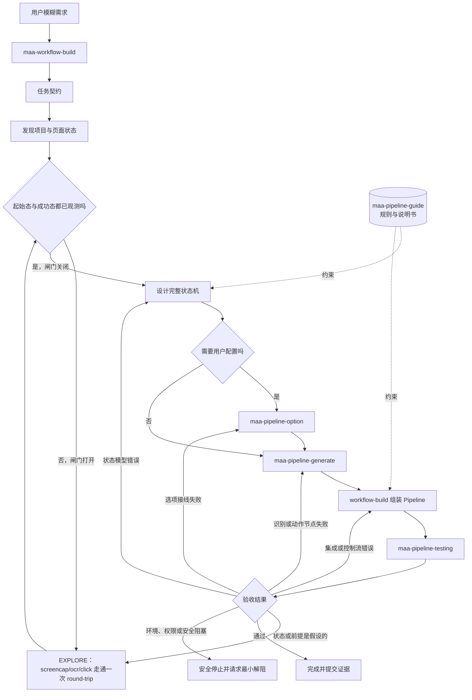

# Maa Workflow Build

将模糊的 Maa 自动化需求转化为可执行、可恢复、可验收的端到端工作流。

## 包含内容

- `skills/maa-workflow-build/SKILL.md`：任务生命周期与跨 skill 编排协议
- `skills/maa-workflow-build/references/`：任务契约、运行状态、探索优先、验收和恢复协议
- `evals/maa-workflow-build.json`：任务级编排评测案例

## 作用

本 skill 负责从用户意图开始，建立目标、起始状态、安全约束和验收条件，随后编排项目发现、Pipeline 设计、节点生成、选项接线与测试技能。只有在必要验收项获得证据后，任务才可以完成。

## 场景未探明时强制探索优先

任务契约里的每个起始状态和成功状态都要标注 `evidence_status`：只有本次任务中的截图、OCR 或识别结果能证明它时才算 `observed`，凭文档、节点名、复用组件的假定前提或模型预期推断出来的一律是 `guessed`。

只要还有必需状态是 `guessed`，探索闸门就是打开的，任务进入 `EXPLORE` 阶段：先用 `screencap` / `ocr` / `click` 把真实 UI 走通**至少一个完整 round-trip**（起始态 → 每个中间态 → 成功态 → 稳定返回态），逐跳记录截图、识别文本和 box。闸门打开期间不写 Pipeline 节点、不写 CustomAction、也不给出成型的实现计划。

这条护栏针对的是一类真实事故：直接调用一个「期望已经在战斗中」的处理器，却没有先探明横幅、准备页、进入战斗、确认开始这一串 UI 入口。复用已有节点、处理器或 CustomAction 时，它们的入口前提本身就是一个必须被观测的状态。

无法探索（没有设备、没有授权入口、通往成功态的唯一路径会触发契约禁止的副作用）时，明确停下来报告缺口，而不是照旧把计划写完。

项目级 `basic_info.md` 与已有 Pipeline 图谱只作为可选上下文产物读取。本 skill 不自动调用 `maa-project-init` 或 `maa-pipeline-graph`；初始化、刷新和图谱生成由用户显式发起。

## 专业 Skill 的职责

- `maa-pipeline-guide` 是规则与说明书；guide 不是执行阶段，也不负责生产节点。
- `maa-pipeline-generate` 是 OCR、TemplateMatch、ROI 和动作节点的主要生产者。
- `maa-pipeline-option` 只在任务要求用户可配置项时调用。
- `maa-pipeline-testing` 在每个可验证实现增量之后运行，并将失败反馈给对应责任方。
- `maa-workflow-build` 负责整体组装、状态机设计、失败路由和最终验收。

这些能力不是固定的 `guide → generate → option → testing` 流水线：

测试不是一次性的末尾动作。局部识别测试通过后还要验证结构、选项接线、失败与恢复路径，最后才执行获得授权的端到端验收。
